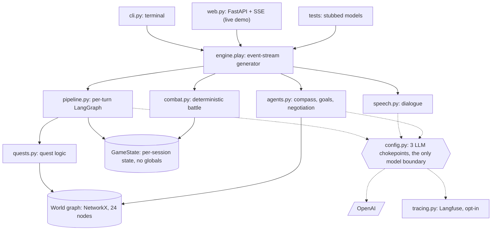
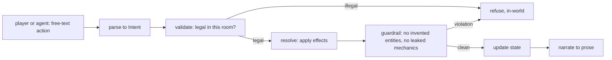

# Agentic RPG Game Master

A graph-grounded, multi-agent fantasy RPG played in text. One to four characters,
human or LLM agents, share a world, take turns, talk in character with each other
and with NPCs, complete interlocking quests, and fight a magic-and-mana battle
system where each fighter chooses its own moves.

**Live demo (watch LLM agents play): https://agent-rpg-watch-llm-agents-turn-this.onrender.com**

> The demo is on a free tier that sleeps when idle, so the first load after a quiet
> spell takes 30 to 60 seconds to wake. Build a party of 1 to 4 agents, press begin,
> and watch a full game stream in: negotiation, combat, quests, and a live map of the
> world graph lighting up as the party moves.

The design principle runs through everything: **consistency lives in code, the
model handles language and bounded choices.** A NetworkX graph holds the world, a
LangGraph pipeline validates and guardrails every action, and combat and quests
resolve in pure Python. The model never decides who wins a fight, where a path
leads, or whether an item exists. It decides what to say, how to act within the
legal options, and, when there is no human in the party, where the group should go
next. This is the production-realistic pattern for shipping LLM agents: give the
model the open-ended judgement and keep correctness in code it cannot violate.

## Where the agency lives

Agents are not on rails. Each turn an agent reads the world state, its memory, the
party roster, and a graph-computed objective compass, then generates an action in
natural language. Its choices have consequences: an agent that fails to prepare or
fights past the point of winning can get the party killed, and a support-disposed
agent that heals the tank can carry a fight. The interesting decisions are
deliberately the model's (preparation, tactics, advocacy) while the scaffold holds
the line where correctness matters (geography, legality, numbers). That split is
the whole point.

What the model decides and what the code decides:

| The model (language + bounded choice) | The code (correctness, no exceptions) |
| --- | --- |
| What a character says, in voice | Whether an exit, item, or NPC exists |
| Which legal action to take this turn | Whether an action is legal in this room |
| How to fight: attack, cast, heal, flee | Who wins, damage numbers, HP and mana |
| Where to argue the party should go | The shortest real route to an objective |
| A character's disposition, from free text | Quest state, gates, and the win condition |

## Architecture

Many drivers, one engine. `engine.play` is a generator that emits display events
and pauses for input, so a terminal, the web demo, and the test suite all drive the
identical core with no duplicated logic. Every model call goes through one of three
chokepoints in `config.py`, which is the only place the system touches an LLM.



### The per-turn pipeline

Each action runs through a small LangGraph pipeline. Parsing and narration are the
model's; validation, resolution, and the guardrail are pure code. An illegal or
fabricated action never reaches the world state; it is refused in-world instead.



### Modules

```
rpg/
  state.py      GameState: all mutable per-session state, no globals; two-lane memory
  config.py     model tiers and the 3 LLM chokepoints (lazy client, offline guard)
  schemas.py    Pydantic types for every structured model call
  world.py      declarative world + objectives + quests tables, graph loader, helpers
  players.py    free-text -> clamped stats + mana + disposition
  pipeline.py   the per-turn LangGraph: parse, validate, resolve, guardrail, update, narrate
  quests.py     data-driven quest logic: acquisition, steps, completion, the win check
  speech.py     the speech channel: NPC and party dialogue, routed by name
  combat.py     spells, mana, potions, per-fighter choice, deterministic resolution
  agents.py     the compass, gated goals, decisions, and the negotiation
  events.py     the display-event dataclasses the engine emits
  engine.py     play(gs): the event-stream generator that drives a whole game
  judge.py      LLM faithfulness grading of narration against the true state
  evals.py      deterministic robustness suite + optional live judge eval
  tracing.py    opt-in Langfuse tracing, strict no-op without keys
  cli.py        a terminal driver
  web.py        a FastAPI watch-only driver: party builder, SSE stream, live world map
```

## Key subsystems

- **The world is a graph.** 11 rooms expand into a 24-node, 33-edge NetworkX graph
  (rooms plus their exits, items, and NPCs). The graph is the source of truth for
  geography and legality; the compass that guides agents is a real shortest-path
  query over it. NetworkX is deliberate: the world is small and static, rebuilt from
  a declarative spec at load, so an in-process graph beats running a database. See
  the design notes below.
- **Dispositions from free text.** A class description and personality become
  clamped stats, mana, and a disposition (combat focus from the class, caution and
  council assertiveness from the personality) in one model call. How a character
  fights and argues falls out of how it was described. The roll has a code fallback,
  so party-building never requires a key.
- **Data-driven quests.** Quests, objectives, and gates live in two declarative
  tables; the logic is general over them, not hand-coded per quest. The current
  world ships four interlocking quests (Recover the Amulet, Kill the Guardian, Hunt
  the Grove Bear, Cleanse the Sanctum) with item and movement gates between them.
  Quests are acquired by talking to the right NPC, and the game is won only when
  every quest is both acquired and completed.
- **A real combat system.** Attack, cast (mana-costed spells), drink a potion,
  defend, or flee; HP and mana persist across fights; a deterministic outlook tells
  a fighter whether it is on track to win or to fall first, so survival can override
  temperament.
- **Multi-agent negotiation.** With no human present, agents argue for a destination
  and an assertiveness-weighted vote resolves it, with the compass as a baseline
  voice so a confident-but-wrong consensus needs real support to override the proven
  route.
- **Two-lane memory.** Spoken dialogue lives in its own lane that narration, combat,
  and quest markers cannot evict, so conversation stays legible across a long game
  while decision-makers still get a composed, time-ordered view of recent events and
  talk.
- **A judge and an eval harness.** A separate judge model grades narration for
  faithfulness against the true state (flagging invented entities, leaked mechanics,
  out-of-character lines, and contradictions), and a deterministic robustness suite
  pins the guardrail as a measurable property rather than a hope. The numbers below
  come from that suite.
- **Opt-in tracing.** With Langfuse keys set, one game is one session and every model
  call is a labelled generation under it; with no keys, the SDK is never imported and
  tracing is a strict no-op.

## What the guardrail actually catches

Run with `rpg-eval`. The robustness suite is deterministic and needs no key:

| Check | Result |
| --- | --- |
| Fabricated actions injected (invented exits, items, NPCs) | 140 detected and contained, 0 reaching world state |
| Legal actions in the same set | 25 passed, 0 false positives |
| Narration leaking game mechanics | 30 of 30 caught |
| Clean narration | 3 of 3 passed untouched |
| Cheating turns in a full scripted game | 22 of 22 blocked |

These assertions also run in the test suite, so a regression that weakened the
guardrail would fail CI rather than ship.

## Run it

```bash
pip install -e ".[dev]"        # core + test tooling
pytest -q                      # 64 tests, deterministic, no key required
ruff check .

export OPENAI_API_KEY=...      # then play in the terminal
export RPG_WORK_MODEL=...       # the model to use for the game
rpg

rpg-eval                       # the robustness numbers above
```

The web demo and the optional extras:

```bash
pip install -e ".[web]"        # adds FastAPI, uvicorn, numpy (for the map layout)
rpg-web                        # serves http://localhost:8000

pip install -e ".[tracing]"   # adds Langfuse; set LANGFUSE_PUBLIC_KEY / _SECRET_KEY / _BASE_URL
```

The model layer is swappable in `config.py`, the client is created lazily, and with
no key set the engine reports offline rather than crashing, so a hosted demo is
turned on and off by adding or removing the key. For reproducible deploys,
`requirements-lock.txt` pins the exact tested versions.

## Tests

The suite is the contract (64 tests, no key required). It stubs the three model
chokepoints and exercises the world loader, the pipeline invariants and gates,
combat and magic, the compass and discovery, the negotiation resolver, the movement
authority, the two-lane memory, the judge and the robustness assertions, the web
endpoints, and a full scripted playthrough that must end with every quest complete
and every invariant intact. CI runs lint and the suite on every push.

## Design notes

- **NetworkX, not a graph database.** The world is 24 nodes rebuilt from a
  declarative spec at load, with all graph logic isolated in `world.py`. A database
  server buys nothing at this scale and would fight clone-and-run simplicity and the
  offline story. The swap stays available and isolated if a future need ever
  justifies it; it does not here.
- **Consistency in code, not in prompts.** The guardrail is not a polite request to
  the model; it is validation the model cannot bypass. That is why fabrication is
  contained rather than merely discouraged.
- **One engine, many drivers.** Terminal, web, and tests share one generator. New
  surfaces are new drivers, not new game logic.

## Honest limitations

- Memory is a rolling window, not long-term recall; an NPC will not remember
  something from twenty exchanges ago, and the dialogue lane is shared across
  speakers rather than threaded per pair.
- The watch-only web demo runs agents only; there is no human-play web mode yet, and
  with no server key it shows an honest error rather than a canned game.
- The content is intentionally small. The point is the engine and the harness, which
  are general over the data; more rooms or quests would not demonstrate anything new.
